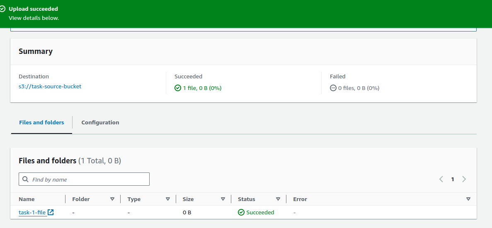
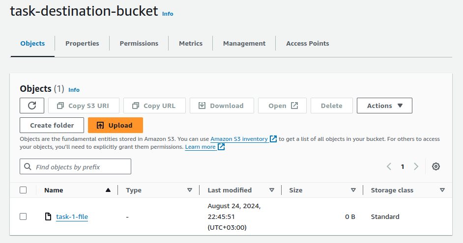

# AWS S3 and DynamoDB Integration with Lambda

This project demonstrates how to use AWS services (S3, DynamoDB, and Lambda) to automate file processing. The process involves the following steps:
1. **Upload a file to S3 Bucket 1.**
2. **Trigger a Lambda function to move the file from S3 Bucket 1 to S3 Bucket 2.**
3. **Store the file name as an item in a DynamoDB table.**

## Architecture Overview

1. **S3 Bucket 1**: The initial storage for the uploaded file.
2. **Lambda Function**: Triggered upon file upload to S3 Bucket 1. It moves the file to S3 Bucket 2 and stores the file name in a DynamoDB table.
3. **S3 Bucket 2**: The final destination for the file.
4. **DynamoDB Table**: Stores the file name as an item.

## Setup Instructions

### 1. Create S3 Buckets

- **S3 Bucket 1**: This bucket will receive the uploaded files.
- **S3 Bucket 2**: This bucket will store the files moved by the Lambda function.

### 2. Create a DynamoDB Table

- **Table Name**: `YourDynamoDBTableName`
- **Primary Key**: `fileName` (String)

### 3. Create a Lambda Function

- **Runtime**: Python 3.x or Node.js (choose based on your preference)
- **Role**: Attach a role with necessary permissions for S3 and DynamoDB access.
- **Function Code**: Use the following template and modify it according to your requirements:

```python
import boto3

s3 = boto3.client('s3')
dynamodb = boto3.resource('dynamodb')

def lambda_handler(event, context):
    # Get the file details from the event
    source_bucket = event['Records'][0]['s3']['bucket']['name']
    file_key = event['Records'][0]['s3']['object']['key']
    
    # Define destination bucket
    destination_bucket = 'YourDestinationBucketName'
    
    # Copy file from S3 Bucket 1 to S3 Bucket 2
    copy_source = {'Bucket': source_bucket, 'Key': file_key}
    s3.copy_object(CopySource=copy_source, Bucket=destination_bucket, Key=file_key)
    
    # Add file name to DynamoDB
    table = dynamodb.Table('YourDynamoDBTableName')
    table.put_item(Item={'fileName': file_key})
    
    return {
        'statusCode': 200,
        'body': f"File '{file_key}' successfully moved to '{destination_bucket}' and recorded in DynamoDB."
    }


