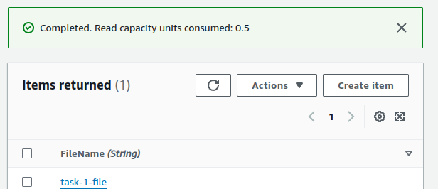

# AWS S3 and DynamoDB Integration with Lambda

This project demonstrates how to use AWS services (S3, DynamoDB, and Lambda) to automate file processing. The process involves the following steps:
1. **Upload a file to S3 Bucket 1.**
2. **Trigger a Lambda function to move the file from S3 Bucket 1 to S3 Bucket 2.**
3. **Store the file name as an item in a DynamoDB table.**

## Architecture Overview

1. **S3 Bucket 1**: The initial storage for the uploaded file.
2. **Lambda Function**: Triggered upon file upload to S3 Bucket 1. It moves the file to S3 Bucket 2 and stores the file name in a DynamoDB table.
3. **S3 Bucket 2**: The final destination for the file.
4. **DynamoDB Table**: Stores the file name as an item.

## Setup Instructions

### 1. Create S3 Buckets

- **S3 Bucket 1**: This bucket will receive the uploaded files.
- **S3 Bucket 2**: This bucket will store the files moved by the Lambda function.

### 2. Create a DynamoDB Table

- **Table Name**: `FileRecords`
- **Primary Key**: `FileName` (String)

### 3. Create a Lambda Function

- **Runtime**: Python 3.x 
- **Role**: Attach a role with necessary permissions for S3 and DynamoDB access.
- **Function Code**: Use the following template and modify it according to your requirements:

```python
import json
import boto3
import logging

# Initialize clients
s3_client = boto3.client('s3')
dynamodb_client = boto3.resource('dynamodb')
table = dynamodb_client.Table('FileRecords')


def lambda_handler(event, context):
    try:
        # Get the bucket name and file name from the event
        source_bucket = event['Records'][0]['s3']['bucket']['name']
        file_name = event['Records'][0]['s3']['object']['key']

        # Copy the file to the destination bucket
        destination_bucket = 'task-destination-bucket'
        copy_source = {'Bucket': source_bucket, 'Key': file_name}
        s3_client.copy_object(CopySource=copy_source, Bucket=destination_bucket, Key=file_name)
       
        # Store the file name in DynamoDB and log the response
        
        table.put_item(Item={'FileName': file_name})
        


    except Exception as e:
        logging.error(f"An error occurred: {e}")
        raise e

```
### 4.Screenshots
 
 
 

